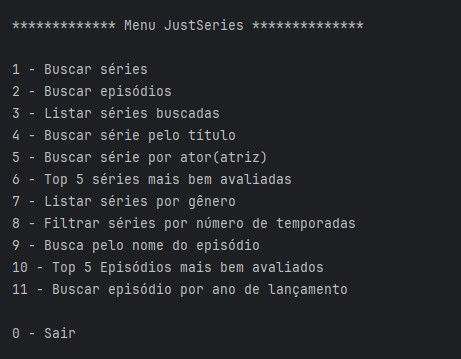
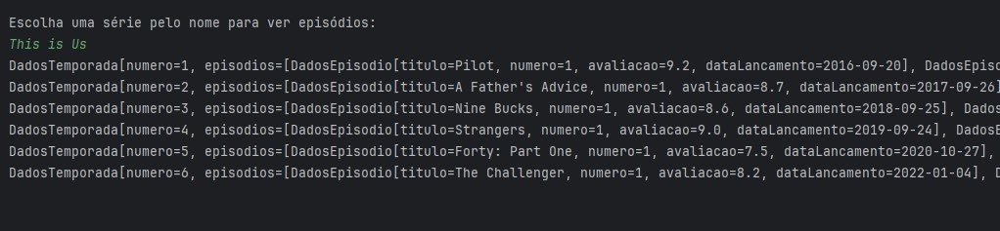
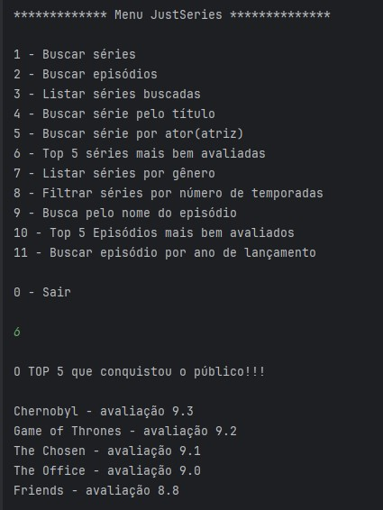
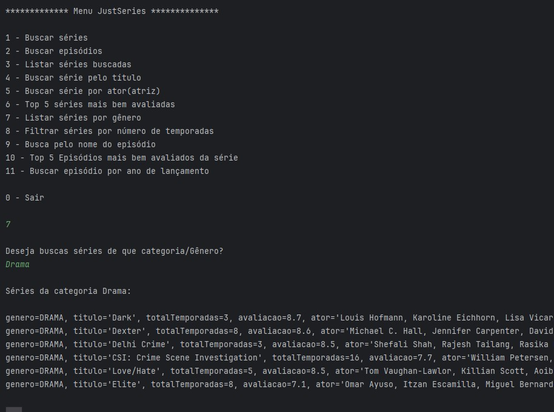
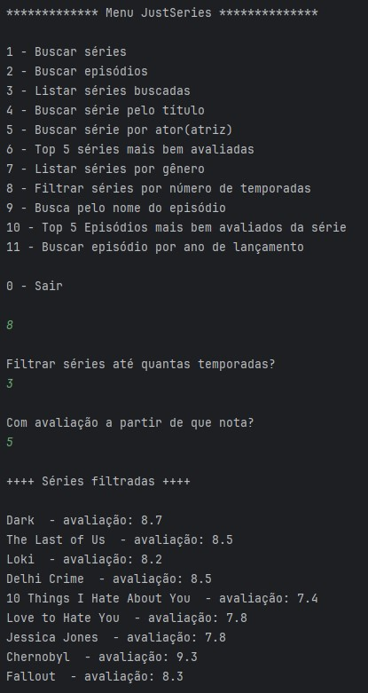
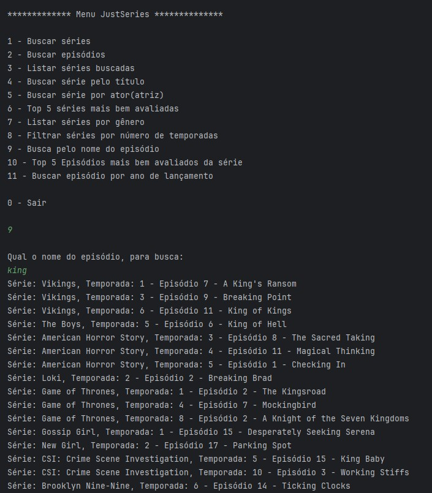
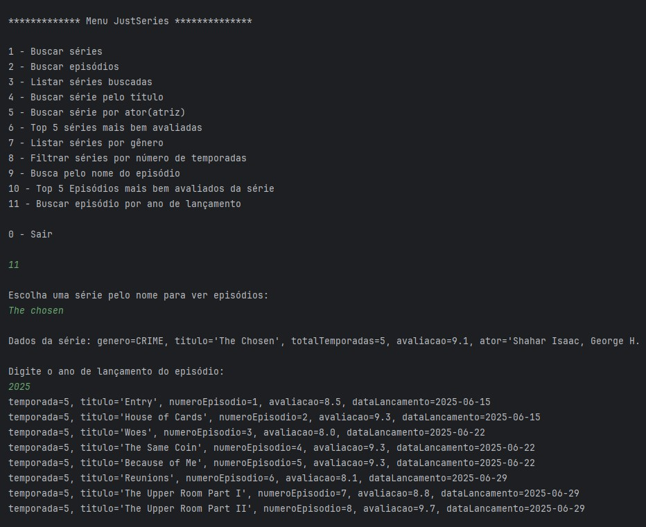

# 🎬 JustSeries - Admin


[](https://gutendex.com/)


A versão administrativa do **JustSeries Streaming** é uma aplicação Java baseada em terminal, responsável pelo gerenciamento completo do catálogo de séries e episódios.

Ela faz parte de um sistema maior que possui também uma versão web read-only, compartilhando os mesmos dados através do banco H2 ou PostgreSQL.

---

## Sobre o projeto

O objetivo da versão admin é permitir a manutenção completa do catálogo de séries, incluindo cadastro, edição, listagem e gerenciamento de episódios.

A aplicação foi desenvolvida com foco em aprendizado de Spring Boot e boas práticas de arquitetura em camadas.

---

## Funcionalidades

- Cadastro de séries
- Cadastro de episódios
- Listagem de séries
- Listagem do top 5 séries
- Listagem por data 
- Persistência de dados
- Integração com API externa (OMDb)

---

## Arquitetura do projeto

O projeto foi organizado utilizando separação em camadas:

- `model` → entidades da aplicação
- `principal` → inicialização da aplicação
- `repository` → acesso ao banco de dados
- `service` → regras de negócio
  
---

## Conceitos e recursos utilizados

- Programação orientada a objetos (POO)
- Enums
- Lists
- Optional (tratamento seguro de dados)
- Streams (utilizado durante o desenvolvimento, posteriormente substituído por **Query Methods**)
- Interfaces
- Records
- Spring Boot
- JPA / Hibernate

---

## Banco de dados

O projeto utiliza dois bancos de dados:

### H2 Database (arquivo)
- Banco local em arquivo
- Utilizado para testes e execução rápida

## Observações importantes

O projeto já está previamente configurado para utilização com o banco **H2 Database** em arquivo.

Algumas séries já foram cadastradas e salvas na pasta de dados da versão administrativa para facilitar a visualização do sistema ao executar a versão web, permitindo que o catálogo já apareça automaticamente no frontend.

Caso deseje adicionar novas séries, basta executar a versão admin, listar as séries já cadastradas e realizar novos cadastros normalmente, evitando duplicidade de registros.

Toda a configuração necessária já está pronta nas duas aplicações. Não é necessário alterar caminhos, bancos ou configurações manualmente.

Após iniciar os projetos, basta acessar a aplicação web pelo navegador através do endereço localhost, `http://localhost:8080/h2-console`
Em seguida preencha os dados de acordo com as configurações presentes no arquivo `application-dev.properties` e clique em Connect.

⚠️ Porta da aplicação

É importante saber em qual porta a aplicação está rodando para acessar o console do H2 no navegador.

Por padrão, o Spring Boot utiliza: http://localhost:8080
Mas essa porta pode variar. Para descobrir a porta, ao iniciar a aplicação, verifique o terminal/log. Procure por uma mensagem do Tomcat semelhante a:

Tomcat started on port(s): 8080
O número exibido será a porta da aplicação.

### PostgreSQL
- Banco principal para persistência real dos dados.
- Alternativa configurável

Caso queira utilizar o PostgreSQL em vez do H2, é necessário configurar corretamente o arquivo `application-prod.properties`.
Nesse arquivo, você deve inserir as informações do seu banco de dados, como:

- URL de conexão  
- Usuário  
- Senha

A configuração do PostgreSQL no projeto está definida utilizando **variáveis de ambiente** no arquivo `application-prod.properties`.

Isso significa que os dados sensíveis (como usuário e senha) **não estão diretamente no código**, o que é a forma mais recomendada. <br>
Para que a aplicação funcione corretamente, você deve:

- Criar as variáveis de ambiente com **os mesmos nomes definidos no projeto**:
  - `DB_URL`
  - `DB_USERNAME`
  - `DB_PASSWORD`

 Alternativa: 
 Caso prefira usar nomes diferentes para as variáveis:
 - Será necessário **alterar também o `application-prod.properties`** para refletir os novos nomes.

### Dúvidas sobre variáveis de ambiente?

Caso tenha dúvidas sobre como criar ou configurar variáveis de ambiente, você pode consultar um outro projeto onde explico esse processo passo a passo.

- [Acesse aqui o guia completo](https://github.com/Kathlynleticia/conversor-de-moedas/tree/main)

---

## Integração com versão Web

A versão admin alimenta diretamente a versão web.

O banco H2 é compartilhado entre as duas aplicações, permitindo que as séries cadastradas no admin sejam exibidas automaticamente no frontend.

---

## Como executar o projeto

### Pré-requisitos

- Java 17+
- Maven
- IntelliJ IDEA (opcional)

---

### 1. Clonar o repositório

```bash
git clone https://github.com/Kathlynleticia/JustSeries
```

### 2. Abrir o projeto

Abra a pasta da versão admin na IDE de sua preferência.

Exemplo:
- IntelliJ IDEA
- VS Code
- Eclipse

### 3. Executar a aplicação

Execute a classe principal do projeto.

Ou utilize o comando:

Windows:

```bash
mvnw.cmd spring-boot:run
```

Linux/Mac:

```bash
./mvnw spring-boot:run
```

### ⚠️ Observação importante (Java / JAVA_HOME)

Em algumas máquinas, o Maven Wrapper pode não funcionar corretamente se o Java não estiver configurado no sistema.

Caso apareça erro relacionado a JAVA_HOME, utilize uma das opções abaixo:

- Solução 1 (recomendada) <br>
Configure o JAVA_HOME no sistema operacional apontando para o JDK instalado.

- Solução 2 (temporária no terminal) <br>
Descubra o JDK rodando isso:

```bash
Get-ChildItem "C:\Program Files\Java"
```
ou 

```bash
Get-ChildItem "C:\Program Files\Eclipse Adoptium"
```
Se aparecer algo tipo:

- jdk-17
- jdk-21

Você roda:

```bash
$env: JAVA_HOME="C:\Program Files\Java\jdk-21"; .\mvnw.cmd spring-boot:run
```
---
## Demonstração - Execução do Sistema
<br>

<br>
<br>
<br>
<br>
<br>
<br>
<br>
<br>
<br>
<br>
<br>
<br>
<br>

## Observações

- O sistema evita duplicação de séries através da listagem prévia antes de novos cadastros
- Algumas validações são feitas diretamente no fluxo do terminal
- O foco principal do projeto é aprendizado de arquitetura Spring Boot e integração com APIs externas

---

## 🙋🏻 Autora

Kathlyn Santos

